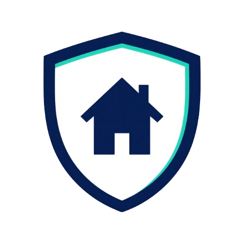
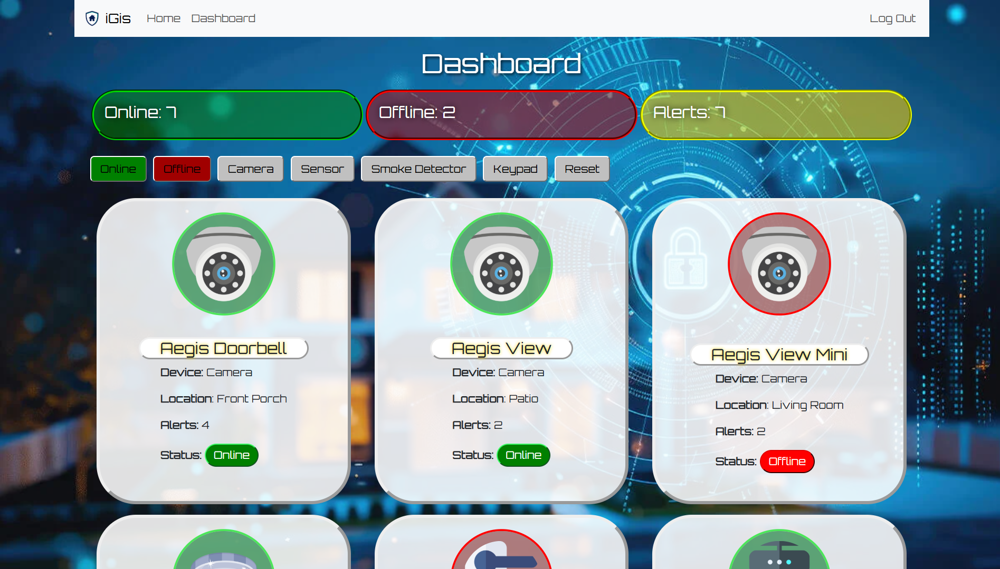

  
   
  <b style="font-size: 28px;">--iGis--</b>
  
Home Security Dashboard

---

# 📸 Preview

---

## ✨ Features

- Live overview shows all device statuses and alerts at a glance.
- Filter only the devices you want to see with quick tabs.
- Activate or disengage your security devices directly on the dashboard.
- Secure login ensure only admins can manage and control device statuses.

---

## 🛠️ Tech Stack

| Category | Technology |
| :--- | :--- |
| **Frontend** | React.js with Bootstrap

---